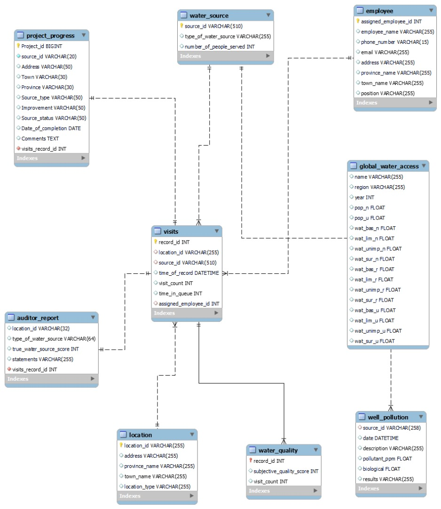

# Maji Ndogo Water Analysis

Access to clean and safe water is a fundamental human right, yet millions of people worldwide still lack access to this essential resource. In alignment with Sustainable Development Goal 6 (SDG 6) - ensuring availability and sustainable management of water and sanitation for all - the project undertakes a comprehensive analysis of water access in Maji Ndogo. Maji Ndogo, grappling with a water crisis, serves as a focal point for this investigation. The primary objectives of this analysis are to assess the existing water resources, evaluate the accessibility of water services, and provide recommendations to enhance access to basic water services within the community.

In Maji Ndogo, the availability and reliability of water sources directly impact the quality of life and well-being of its residents. Thus, understanding the distribution, reliability, and usability of water sources is crucial. This project seeks to delve into the intricacies of water access by examining the types of water sources utilized by the community, determining the total and average number of users for each source, and exploring the duration individuals typically spend waiting in queues to access water.
Conducted a vivid investigation on water resources in Maji Ndogo

## Description
Through rigorous data collection and analysis, this study aims to shed light on the current state of water access in Maji Ndogo, identifying gaps, challenges, and opportunities for improvement. By synthesizing empirical evidence and community insights, the project endeavors to formulate actionable recommendations tailored to address the pressing water access issues faced by the community. Ultimately, the overarching goal is to contribute to the restoration of access to basic water services, fostering resilience and sustainability in the face of the ongoing water crisis.

This analysis serves as a catalyst for informed decision-making and targeted interventions, emphasizing the urgency of addressing water access challenges to safeguard the health, dignity, and rights of Maji Ndogo's residents. By harnessing the power of data-driven insights and community engagement, I endeavor to pave the way towards a future where equitable access to clean and safe water is a reality for all.

## Modelling
The modellling ..........

## Data Wrangling and Structuring
Some of the tasks I performed in the initial phase include:
- update employees name
- update employees email and phone number

## Data Analysis
See full SQL file here: https://github.com/Mary-Ukoh/Maji-Ndogo-Water-Analysis/blob/main/Maji%20Ndogo%20Water%20analysis.ipynb

## Water Sources
query

result

## Locations
query

result

## Population of People With Access to Water
query

value

## Visualization
In the exploration of Maji Ndogo's water resources, Power BI has been instrumental in crafting compelling visualizations that illuminate key data points and narratives. Through interactive and insightful visual representations, I have embarked on a journey to unravel the complexities of water access within the community.
This visualization not only highlights the availability of different water sources but also underscores the disparities in access and reliability across the community.
Click this link to see report here: https://www.novypro.com/profile_projects/maryhenry  

