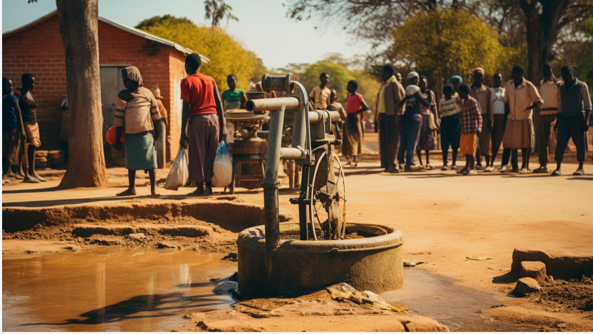
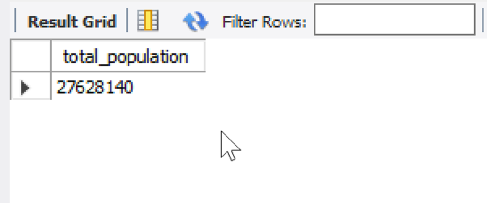

# Maji Ndogo Water Analysis

Conducted a vivid investigation on water resources in Maji Ndogo

## Description
The database contains data records of water survey for the analysis

## Modelling
The modellling ..........

## Water Sources
syntax

result

## Population of People With Access to Water
syntax

value

